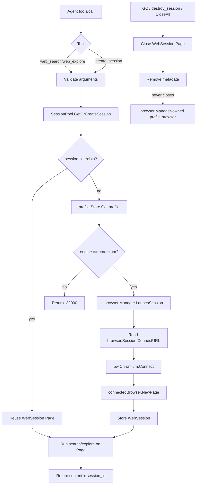

# Agent Web Session Architecture

## Purpose

`web_search` and `web_explore` let MCP agents use BrowseForge's anti-detect Chromium/CloakBrowser profiles for search and page exploration without taking ownership of the profile browser lifecycle.

The final architecture is **profile-browser owned, agent-page isolated**:

```text
Agent MCP call
  -> internal/mcp.Server tool handler
  -> SessionPool.GetOrCreateSession(profile_id, session_id)
  -> browser.Manager ensures one persistent profile browser
  -> Playwright Bind endpoint from browser.Session.ConnectURL
  -> pw.Chromium.Connect(connectURL)
  -> connectedBrowser.NewPage()
  -> one independent Page per agent web session
```

## Non-goals

- No standalone headless `Searcher` browser.
- No Camoufox/Firefox path for MCP web search/explore.
- No per-agent `BrowserContext` creation in the connected browser.
- No agent-session code may close the profile browser owned by `browser.Manager`.

## Ownership Boundaries

| Resource | Owner | Closed by |
|----------|-------|-----------|
| Profile record | `profile.Store` | Profile APIs |
| Persistent profile browser | `browser.Manager` | Browser/session APIs or server shutdown |
| Playwright Bind endpoint | `browser.Manager` / browser session | Browser/session lifecycle |
| Agent web session metadata | `mcp.SessionPool` | `destroy_session`, GC, `CloseAll` |
| Agent page | `mcp.SessionPool` | `destroy_session`, GC, `CloseAll` |
| Shared Playwright driver | `browser.Manager` | Process/server lifecycle |

## Runtime Model

### One profile = one browser

`browser.Manager.LaunchSession(profileID)` starts or returns the persistent browser for the profile and exposes its Playwright Bind endpoint as `Session.ConnectURL`.

For MCP web sessions, the profile must be Chromium/CloakBrowser (`profile.Engine == "chromium"`). This keeps the web search/explore feature aligned with the anti-detect Chromium browser path.

### One agent session = one page

`SessionPool.CreateSession(profileID)`:

1. Loads the profile from `profile.Store`.
2. Rejects non-Chromium profiles.
3. Ensures the profile browser exists through `browser.Manager.LaunchSession(profileID)`.
4. Connects to `browser.Session.ConnectURL` with `pw.Chromium.Connect(connectURL)`.
5. Opens an independent page with `connectedBrowser.NewPage()`.
6. Stores `WebSession{ID, ProfileID, BrowserID, Page, CreatedAt, LastAccessed}`.

A later call with the same `session_id` reuses that same page and serializes operations with the session mutex.

## MCP Tools

### `web_search`

Required:

- `query`
- either `profile_id` or existing `session_id`

Optional:

- `max_results` (default `10`, clamped by search implementation)

Returns text content plus top-level `session_id`, `profile_id`, and `session_created`.

### `web_explore`

Required:

- `url`
- either `profile_id` or existing `session_id`

Optional:

- `max_text_length` (default `3000`, clamped to `10000`)
- `max_links` (default `50`, clamped to `200`)

Returns JSON text content plus top-level `session_id`, `profile_id`, and `session_created`.

### Session lifecycle tools

- `create_session(profile_id)` creates an independent page for a Chromium profile.
- `destroy_session(session_id)` closes that page and removes metadata.
- `list_sessions(profile_id?)` returns active session metadata.
- `gc_sessions()` immediately runs idle/max-session garbage collection.

## Garbage Collection

Defaults:

| Setting | Default |
|---------|---------|
| Idle TTL | 5 minutes |
| Sweep interval | 1 minute |
| Max sessions per profile | 10 |

GC behavior:

1. Close sessions idle longer than TTL.
2. If a profile exceeds the max session count, close oldest sessions until within limit.
3. Close only the agent `Page` and remove session metadata.
4. Never call `Browser.Close()` on the connected profile browser handle.
5. Never call `browser.Manager.CloseSession()` from `SessionPool` GC/destroy/CloseAll.

## Error Model

MCP tool handlers use JSON-RPC errors:

| Code | Meaning |
|------|---------|
| `-32602` | Missing required arguments such as `query`, `url`, `profile_id`, or `session_id` |
| `-32000` | Runtime/session failures such as unavailable session pool, profile not found, non-Chromium profile, connect/navigation/search failure |

## Mermaid Flow



## Review Checklist

- `SessionPool` may close pages, not profile browsers.
- Documentation should say `Page` isolation, not `BrowserContext + Page` isolation.
- API examples should include `profile_id` for new sessions and preserve `session_id` for reuse.
- Runtime validation must reject Firefox/Camoufox profiles for MCP web sessions.
